# Lab 01 — IAM

## Summary

This lab set up a local AWS environment using Floci (run through Docker
Compose) and built the IAM foundation for the USMS project on top of it.

Part A made sure the environment keeps its data across restarts — Floci
defaults to in-memory storage, so I configured `docker-compose.yml` to use
`FLOCI_STORAGE_MODE=hybrid` with a real folder bound to the container, and
proved it works by creating a user, restarting, and confirming it survived.

Part B built the actual IAM structure: three groups, three users, several
policies controlling access, and three roles for different purposes (an EC2
server role, a Lambda role, and a role developers can temporarily assume).

## Environment setup

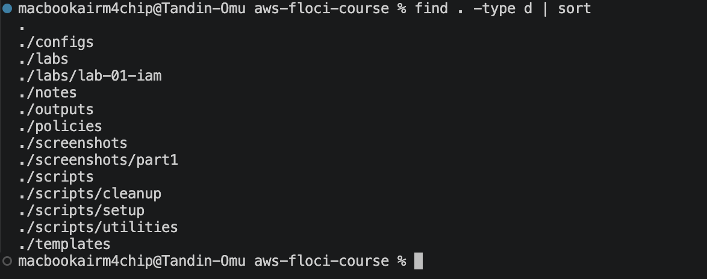
*Folder structure created before Floci was started, as required.*

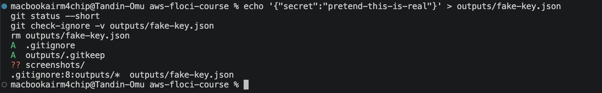
*Proved `outputs/*` correctly ignores files before any real secret existed.*

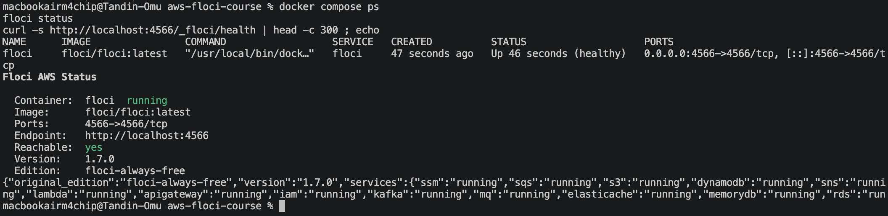
*Container started through `docker-compose.yml`, health check passing.*

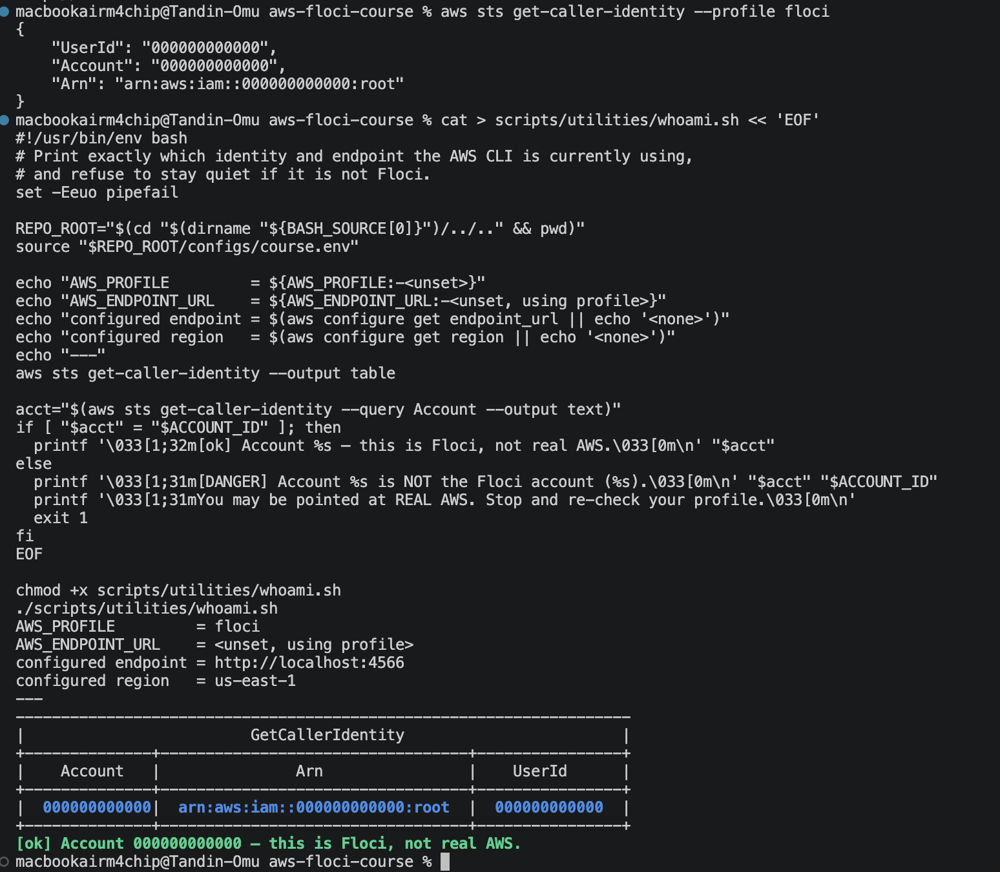
*Confirms the AWS CLI is talking to Floci, not real AWS.*

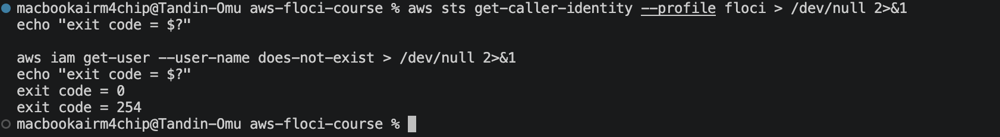
*A user created before a container restart still existed after it.*

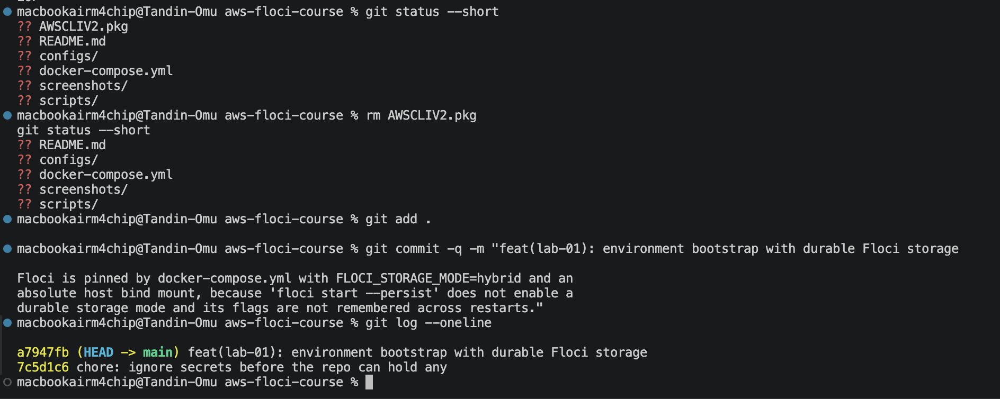
*Full diagnostic confirming durable storage is correctly configured.*

## IAM foundation

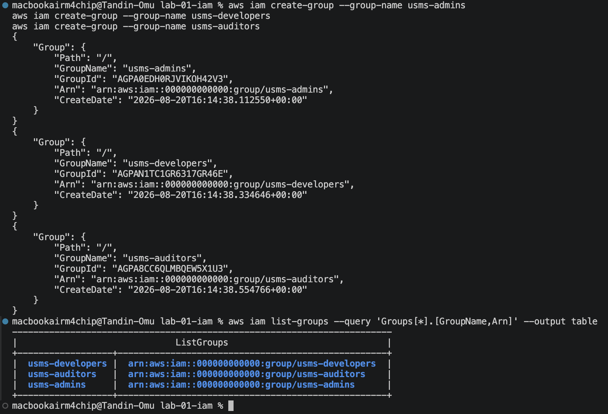
*`usms-admins`, `usms-developers`, `usms-auditors`.*

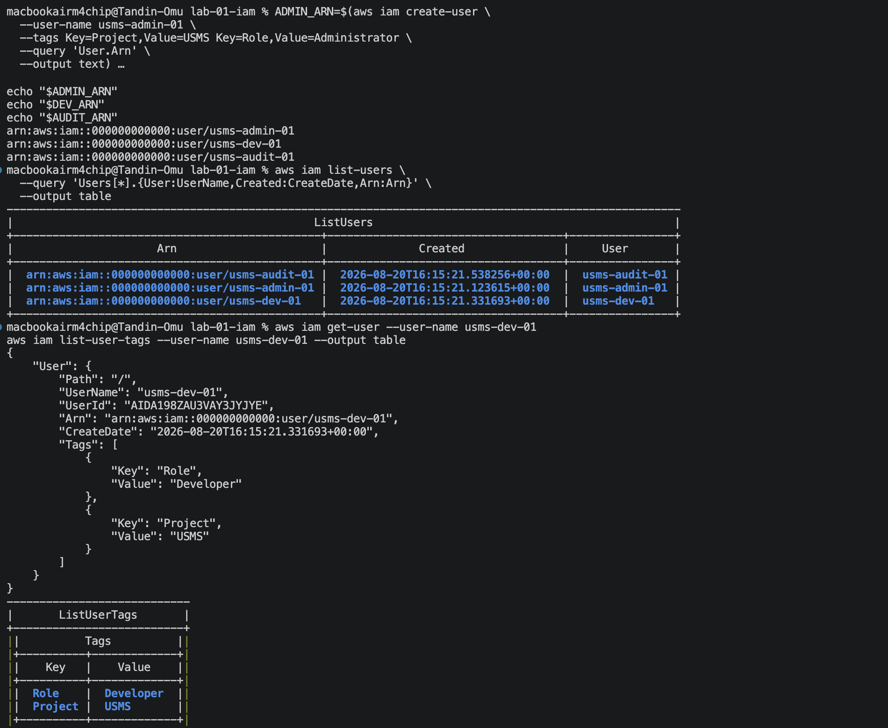
*`usms-admin-01`, `usms-dev-01`, `usms-audit-01`.*

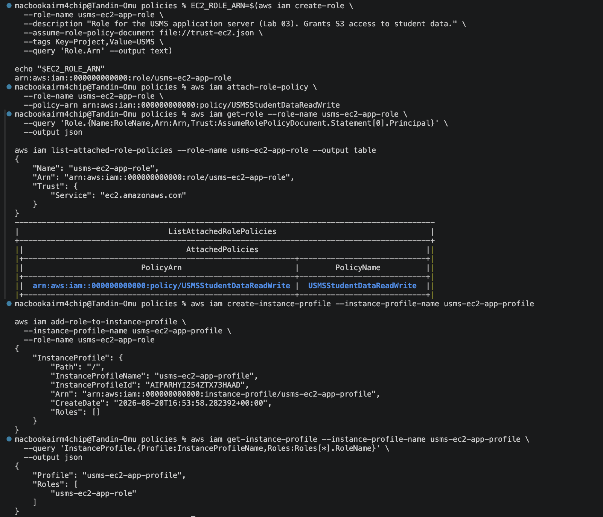
*`usms-ec2-app-role` created with a trust policy and wrapped in an instance profile.*

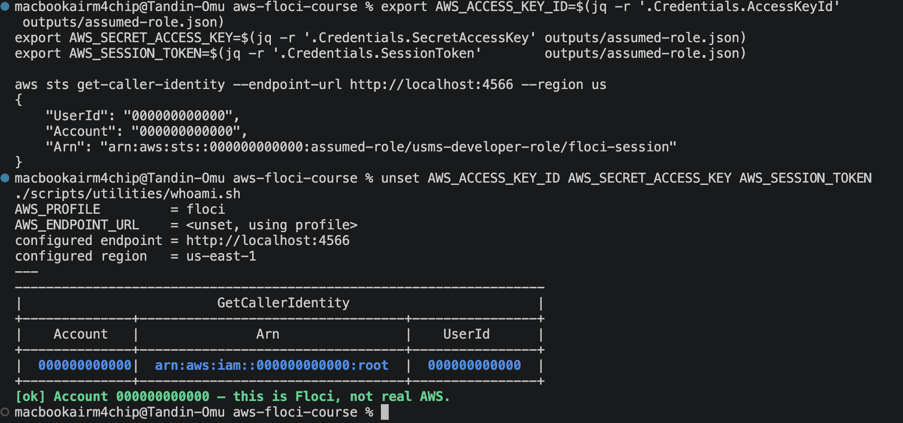
*Assumed `usms-developer-role` and obtained short-lived credentials.*

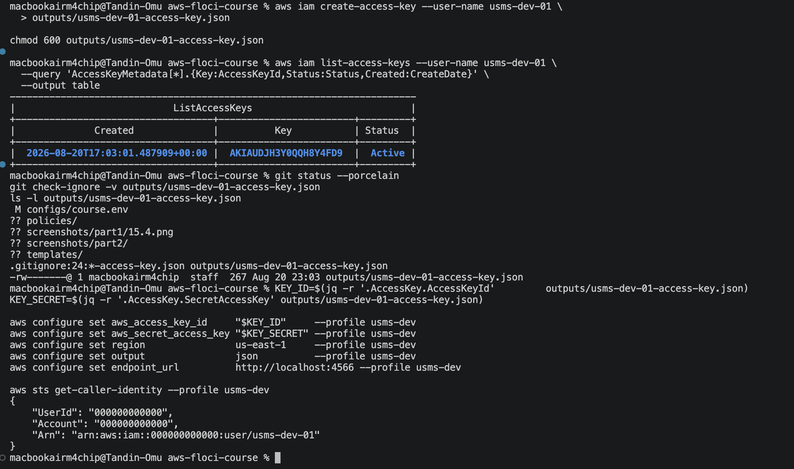
*Confirmed the key file is excluded from version control.*

## Exercises

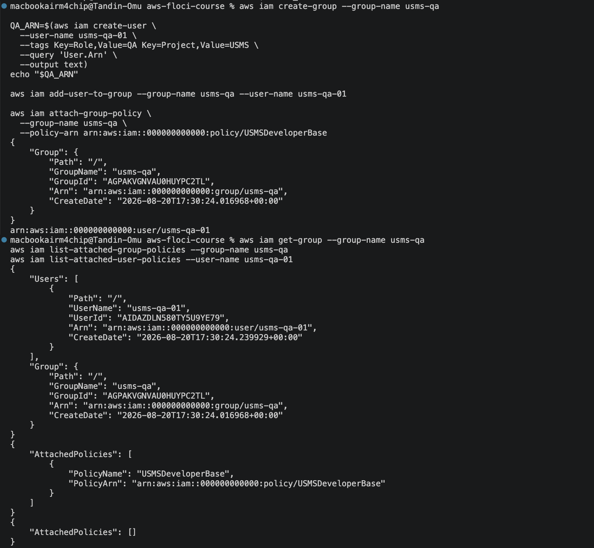
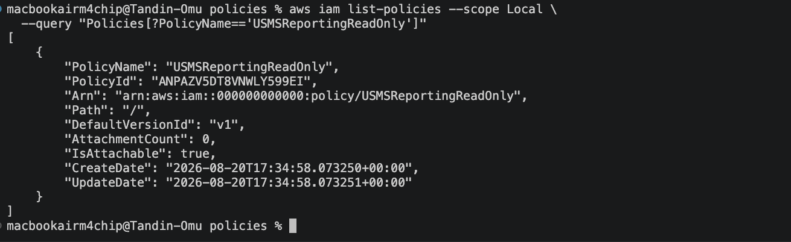
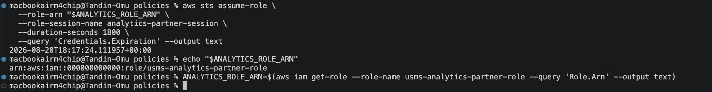
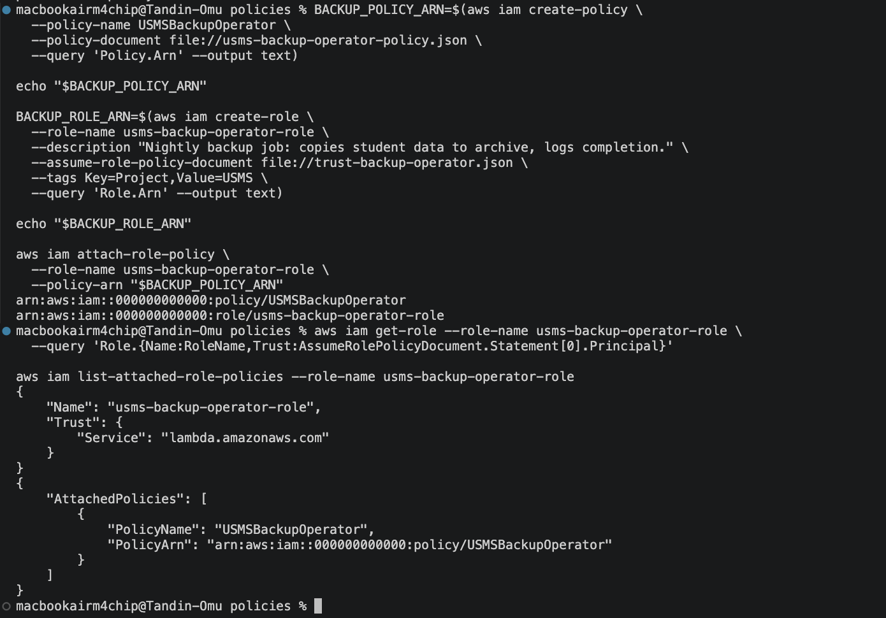
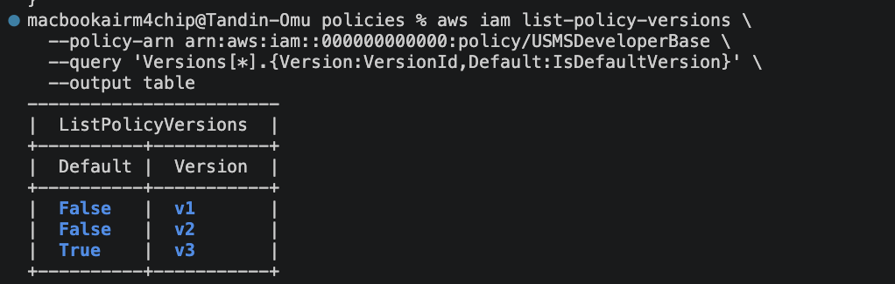

## Final verification

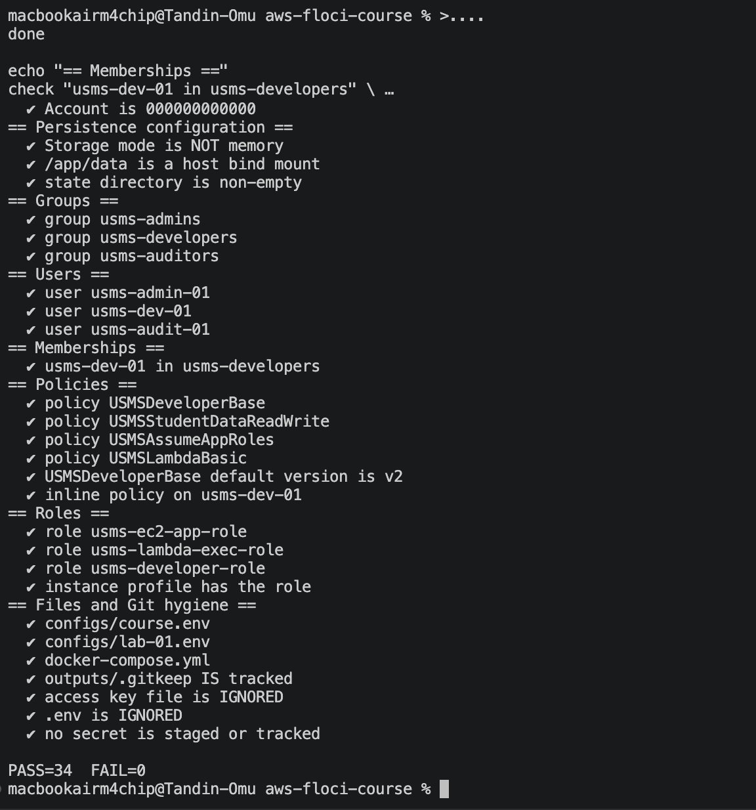
*All 34 automated checks pass: environment, persistence, groups, users,
policies, roles, and Git hygiene.*

## Checklist
- [x] whoami.sh shows account 000000000000
- [x] Persistence proven (user survived a restart)
- [x] verify-lab-01.sh — FAIL=0
- [x] Exercises 1–5 completed
