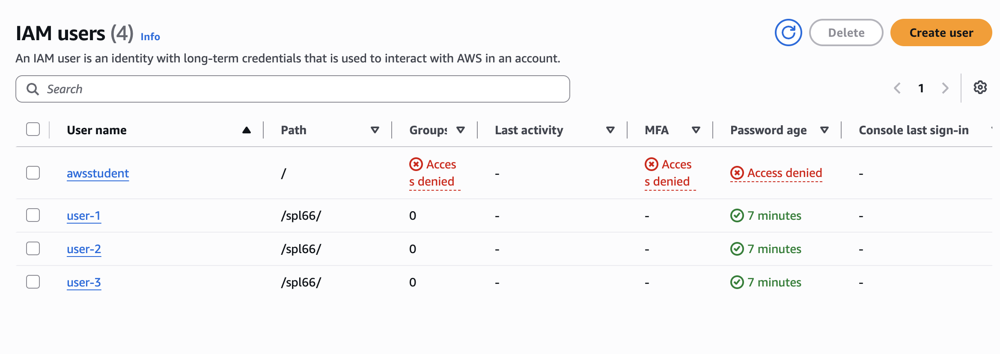

# Lab 01 - Identity and Access Management

## 1. Aim / Objective

To create and manage IAM users, groups, roles, and policies using the AWS CLI against a local AWS emulator (Floci), and to verify that the correct identities, permissions, and access relationships were created.

## 2. Introduction

AWS IAM controls who can access AWS resources and what they can do.

It uses users, groups, roles, and JSON policies to manage permissions. IAM also provides temporary credentials and allows access to be limited to specific actions and resources.

IAM is commonly used to give employees the right access, allow servers to use roles instead of permanent keys, and separate access for admins, developers, and auditors.

## 3. Use Case

- Managing employee access and permissions using AWS IAM.
- Giving EC2 temporary access through a role instead of a permanent key.
- Allowing Lambda to access only the data and logs it needs.
- Giving auditors read-only access without allowing them to make changes.

## 4. System Architecture / Design

The lab environment consisted of Floci, a local AWS emulator, run inside
Docker and managed through Docker Compose. The AWS CLI on the host machine was configured with a profile pointing at Floci's endpoint
(`http://localhost:4566`), so every command behaved exactly as it would
against real AWS, without needing an actual AWS account.

## 5. Implementation Procedure

1. Verified Docker and Docker Compose were installed and working.

2. Created the required project structure and initialized Git securely.

3. Configured .gitignore to prevent secrets from being committed.

4. Set up Floci with persistent hybrid storage using Docker Compose.

5. Started Floci and confirmed it was running correctly.

6. Installed AWS CLI v2 and configured a local floci profile.

7. Verified that AWS CLI requests were reaching Floci instead of real AWS.

8. Tested data persistence by restarting Floci and checking stored users.

9. Created IAM groups, users, roles, and required policies.

10. Configured managed and inline policies with appropriate permissions.

11. Created and managed policy versions while maintaining previous versions.

12. Created IAM roles for EC2, Lambda, and developers, including an EC2 instance profile.

13. Tested role assumption using temporary STS credentials.

14. Created an access key securely and ensured it was excluded from Git.

15. Used the policy simulator to verify access permissions.

16. Recorded resource ARNs and backed up the environment state.

17. Ran an automated verification script to confirm all required resources.

18. Completed five additional exercises covering IAM users, groups, policies, roles, and least-privilege access.

## 6. Results and Evidence

### 6.1 CLI / SDK Output

**Environment setup**

*OS, shell, and home directory confirmed before starting.*

*Docker daemon reachable and Compose v2 present.*

*Floci CLI installed and available on the PATH.*

*Environment diagnostics run before starting any container.*

*Folder tree created before Floci was started.*

*Full folder listing matching the required layout.*

*Ignore rules written and Git repository initialised.*

*`.gitignore` and `.gitkeep` staged as the first commit.*

*A fake secret file correctly ignored by Git before continuing.*

*Shared, non-secret configuration values defined.*

*Compose file parses correctly; required-variable guard fires as expected.*

*Start script created with preconditions and self-verification.*

*Stop script created; state is preserved on pause.*

*Container pulled and started through Compose.*

*Health endpoint responding; bind mount verified as real, not a phantom volume.*

*`aws --version` confirms CLI v2 is installed.*

*`floci` profile created with dummy credentials and `endpoint_url` set.*

*`sts get-caller-identity` returns account `000000000000`, confirming Floci, not real AWS.*

*Request URL confirmed as `localhost:4566`, not `amazonaws.com`.*

*Stopping Floci breaks the CLI, proving no fallback to real AWS.*

*A test user created before restarting the container.*

*The same user still exists after a full container restart.*

*Container ownership and Compose project verified.*

*Storage mode confirmed as durable, not memory.*

*Bind mount and host directory verified as real and non-empty.*

*Full diagnostic passing; environment setup committed to Git.*

**IAM foundation**

*`list-users` returns an empty list before any identity is created.*

*`usms-admins`, `usms-developers`, `usms-auditors` created.*

*`usms-admin-01`, `usms-dev-01`, `usms-audit-01` created with ARNs captured.*

.png)
*`usms-intern-01` created following the same pattern.*

*Membership verified from both the group and user side.*

.png)
*`usms-intern-01` added to `usms-auditors`; group now has two members.*

*Read-only policy attached to the auditors group.*

*Customer managed policy written, validated, and attached to two groups.*

*Policy written with separate bucket and object ARNs.*

*Parameter template generated without contacting Floci.*

.png)
*Skeletons generated for `create-policy` and `create-vpc`.*

*Self-service credentials policy added using `${aws:username}`.*

*Groups, attached policies, inline policies, and access keys reviewed.*

*Policy updated to v2 without editing the original in place.*

*Trust policy naming `ec2.amazonaws.com`; role wrapped in an instance profile.*

*Trust policy naming `lambda.amazonaws.com`; log-write permissions attached.*

*Account-principal trust policy naming `usms-dev-01`.*

*Second half of the trust handshake completed for the developers group.*

*Temporary credentials obtained by assuming the developer role.*

*Returned to the normal identity after using the temporary credentials.*

*Key redirected to a file, permissions restricted, confirmed Git-ignored.*

*Simulated decisions checked against the developer's policy.*

.png)
*Prediction verified for the auditor's read vs. write permissions.*

*All ARNs from this lab captured into a reusable configuration file.*

*State archived using the tar fallback, since native snapshotting was unsupported.*

*Lab summary completed describing what was built.*

*Final commit for the IAM foundation.*

**Verification**

*Every required resource and Git-hygiene rule checked automatically, with no failures.*

**Exercises**

*Group and user created; policy attached to the group only.*

*Prefix-restricted read access with explicit deny on write and delete.*

*Cross-identity role created with both halves of the trust handshake in place.*

*Least-privilege role designed from a job description, with region restriction.*

*Missing VPC actions identified and added as a new default policy version.*

*`verify-lab-01.sh` updated to check the new default version.*

# Review Questions

**Q1. A colleague creates a role with a perfect permissions policy attached, but nobody can use it. What is almost certainly missing, and why does IAM separate these two documents in the first place?**

The missing part is the trust policy. It decides who can assume the role, while the permissions policy decides what the role can do.

**Q2. `usms-dev-01` gets AccessDenied calling `iam:CreateUser`, and also calling `dynamodb:PutItem`. Both fail identically from the user's point of view. Explain how the two failures differ internally, how you would tell them apart, and why the fix is different in each case.**

iam:CreateUser has an explicit deny, while dynamodb:PutItem has an implicit deny. An implicit deny needs an Allow, while an explicit deny must be removed or changed.

**Q3. Explain why attaching `usms-ec2-app-role` to the server is more secure than putting `usms-dev-01`'s access key in the application's configuration file. Give two distinct reasons.**

A role uses temporary credentials, so there is no permanent key stored on the server. It also gives the server only the permissions it needs.

**Q4. A student writes a policy allowing `s3:GetObject` and `s3:ListBucket` on the single resource `arn:aws:s3:::usms-student-data`. Downloads fail. Explain precisely why, and state what the corrected Resource values must be.**

The problem is that the bucket ARN only points to the S3 bucket, not the files inside it. s3:ListBucket should use arn:aws:s3:::usms-student-data, while s3:GetObject should use arn:aws:s3:::usms-student-data/*.

**Q5. Every command in this lab succeeded. Explain why that is not evidence that your policies are correct, and describe two concrete techniques you would use to gain confidence in a policy before deploying it to a real AWS account.**

Successful commands do not prove the policies are correct because Floci does not fully enforce IAM policies. I would review the policies and use aws iam simulate-principal-policy on real AWS.

**Q6. A classmate ran `floci start --persist ~/floci-data --detach`, saw the directory get created, and concluded persistence was working. Their IAM users vanished the next morning anyway. Explain the three independent reasons this could happen, and describe the single test that would have caught it in under a minute.**

Persistence may fail because of the storage mode, the ~ path, or settings resetting after restart. The easiest test is to create a resource, restart Floci, and check if it still exists.

**Q7. Argue why `docker-compose.yml` being a committed file is a security and reproducibility property, not merely a convenience. What can an instructor or a colleague verify from your repository that they could not verify from a command you typed?**

A committed docker-compose.yml shows exactly how the environment is configured. Others can check the storage, volume mounts, and security settings.

### 6.2 AWS Management Console Verification

## 7. Reflection

1. **What I learned about this service.** I learned that IAM uses separate trust and permission policies. I also learned about explicit and implicit denies.

2. **Challenges encountered.** The main challenges were incorrect file paths and Floci limitations. These were solved by checking the configuration and using alternative methods.

3. **Real-world application.** IAM can be used to control access for different team members. Roles can also be used instead of permanent access keys for servers.

4. **What I would like to explore further.** I would like to learn how IAM policies are enforced on real AWS. This would help me understand permissions and access denials better.

## 9. Conclusion

This lab successfully created a persistent AWS environment and IAM structure for the USMS project. I learned about IAM policies, least privilege, and access control.

I also gained experience with IAM policy writing, AWS CLI commands, and troubleshooting. These skills are useful for managing secure AWS environments.

## 10. Appendix

- IAM policy JSON files: `policies/`
- Environment configuration: `configs/course.env`, `configs/lab-01.env`
- Verification script: `scripts/utilities/verify-lab-01.sh`
- Storage diagnostic script: `scripts/utilities/floci-storage-check.sh`
- Full screenshot set: `screenshots/part1/`, `screenshots/part2/`,
  `screenshots/exercises/`, `screenshots/verification/`
- Detailed conceptual notes and review question answers: `notes/lab-01-notes.md`