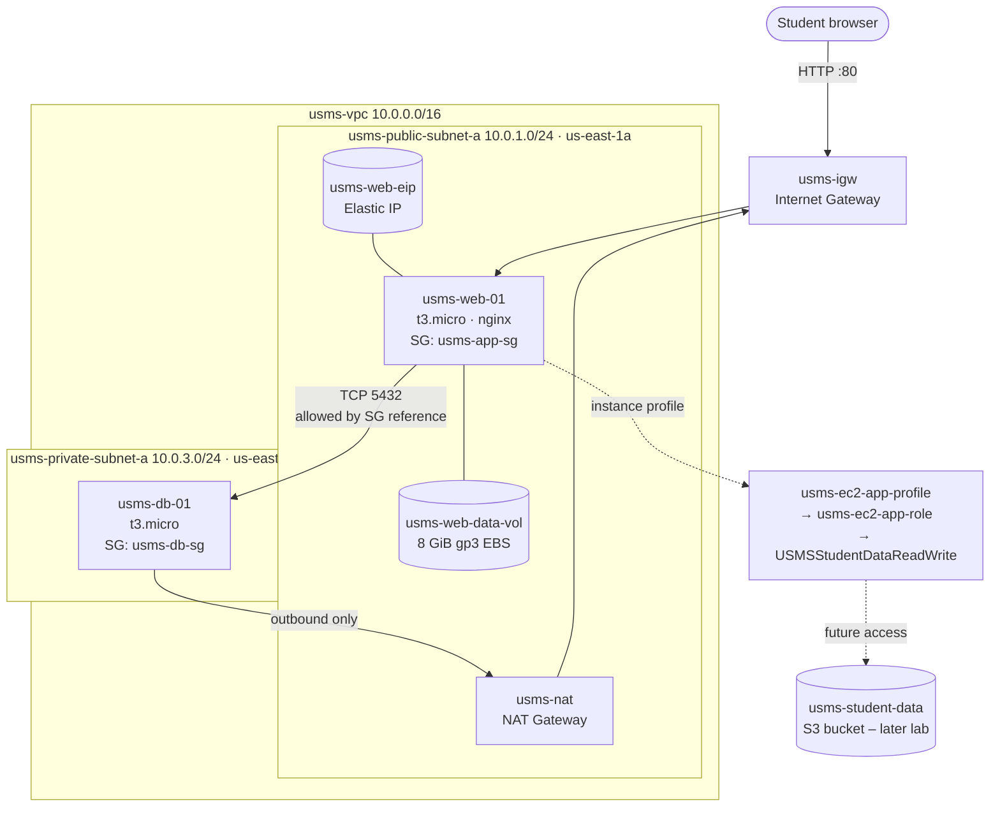

# Lab 03 - Amazon EC2 and Deploying the USMS Application

**Course:** DSO303 &nbsp;|&nbsp; **Environment:** Floci (local AWS emulator) under Docker Compose, hybrid storage, AWS CLI v2 on macOS

---

## 1. Aim / Objective

To deploy the University Student Management System (USMS) web tier on Amazon EC2 using the AWS CLI. The instance is launched into the public subnet and security group built in Lab 02, with the IAM instance profile created in Lab 01. The lab also bootstraps the instance with a user-data script, gives it a stable public address with an Elastic IP, attaches a persistent EBS data volume, and verifies each configuration property independently rather than trusting command success.

## 2. Introduction

Amazon Elastic Compute Cloud (EC2) provides resizable virtual servers in the AWS cloud. An EC2 instance is produced by combining three things: an Amazon Machine Image (AMI), which is a template for the root disk; an instance type, which defines the hardware (vCPUs, memory, network); and optional user data, a script that cloud-init runs as root on first boot so the server configures itself without anyone logging in. Supporting features include key pairs for SSH access, security groups as instance-level firewalls, Elastic IPs for addresses that outlive any single instance, EBS volumes for block storage with a lifecycle independent of the instance, and IAM instance profiles, which deliver temporary credentials to software on the instance so no access keys are ever stored on disk. EC2 is the foundational compute service of AWS. Most other services either run on it or are compared against it, and it is the usual starting point for lifting traditional server workloads into the cloud.

## 3. Use Case

- Hosting web applications and APIs, such as the USMS student portal served by nginx in this lab.
- Running a multi-tier architecture: public web servers in front, private application or database servers behind them, separated by subnets and security groups.
- Providing batch processing, build servers and CI runners that are launched on demand and terminated when finished.
- Building "golden" AMIs so that Auto Scaling groups can launch pre-configured, identical servers quickly.
- Running legacy or licensed software that needs full control of the operating system.

## 4. System Architecture / Design

**Data flow:** A request from the browser enters through the internet gateway, follows the public route table to `usms-public-subnet-a`, passes the network ACL and `usms-app-sg` (TCP 80 from `0.0.0.0/0`), and reaches nginx on `usms-web-01` at its Elastic IP. The web tier is the only source that `usms-db-sg` admits on TCP 5432. The data tier has no public address and leaves the VPC only outbound, through the NAT gateway. `usms-web-01` obtains AWS permissions through its instance profile, not through stored keys.

## 5. Implementation Procedure

All commands were run from the repository root (`aws-floci-course/`) against Floci at `http://localhost:4566`.

**Step 1 – Resume the environment.** Started Floci with `floci-up.sh`, sourced `course.env`, `lab-01.env` and `lab-02.env`, and printed the six values this lab depends on (subnets, security groups, instance profile, AZ) to confirm none were empty.

**Step 2 – Confirm Lab 02's network.** Ran `verify-lab-02.sh` to check that the VPC, subnets, gateways and security groups were still intact before building on them.

**Step 3 – Choose an AMI.** Listed available images with `describe-images --owners amazon` and captured an image ID into `$AMI_ID` programmatically rather than copying one by hand. On real AWS the correct technique is resolving the SSM public parameter `/aws/service/ami-amazon-linux-latest/al2023-ami-kernel-default-x86_64`. *AMI option used: [Option A / B / seeded image – fill in].*

**Step 4 – Create the key pair.** Created `usms-app-key` and redirected the private key straight into `outputs/usms-app-key.pem`, so that it never appeared on screen, then applied `chmod 600`.

**Step 5 – Prove the key is git-ignored.** `git check-ignore -v` named the `.gitignore` rule (`outputs/*`) that matches the key file, and `git ls-files outputs/` showed only `.gitkeep`.

**Step 6 – Write the user-data script.** Wrote `labs/lab-03-ec2/user-data.sh`, which installs nginx, queries IMDSv2 for the instance ID, AZ and private IP, and writes an `index.html` page and a `health.json` endpoint. A quoted outer heredoc kept the variables unexpanded until boot time. `bash -n` confirmed the syntax, and the size was well under the 16 KB limit.

**Step 7 – Generate a request skeleton.** Generated the full `run-instances` skeleton (300+ lines) with `--generate-cli-skeleton`, then wrote a trimmed request, `templates/lab-03-run-instances.json`, containing the AMI, instance type, key, subnet, security group, instance profile and tags for both the instance and its root volume. Validated it with `python3 -m json.tool`.

**Step 8 – Launch the web server.** Launched `usms-web-01` with `--cli-input-json` plus `--user-data file://…`. This single call combined resources from Lab 01 (instance profile), Lab 02 (subnet and security group) and Lab 03 (key pair and script).

**Step 9 – Wait for running.** Used `aws ec2 wait instance-running` instead of `sleep`. The waiter polls `describe-instances` every 15 seconds for up to 40 attempts.

**Step 10 – Read the instance back.** Projected the important fields from `describe-instances` (state, subnet, private and public IP, security group, profile, key) and confirmed each against its expected value.

**Step 11 – Trace the permission chain.** Followed the chain instance → `usms-ec2-app-profile` → `usms-ec2-app-role` → `USMSStudentDataReadWrite` and saved the policy document to `outputs/lab-03-instance-policy.json`. The policy grants access to `usms-student-data`, a bucket that does not yet exist.

**Step 12 – Prove the user data arrived.** Read the `userData` attribute back, decoded it with `openssl base64 -d -A`, and compared it against the original file with `diff`.

**Step 13 – Allocate an Elastic IP.** Allocated `usms-web-eip` with `allocate-address --domain vpc` and associated it with `usms-web-01`. The auto-assigned public address was replaced by the Elastic IP.

**Step 14 – Test the application.** Ran `curl` against the Elastic IP (primary path), then ran the six-check fallback proving every configurable link a request depends on: instance running, IGW route, IGW attached, security group allows TCP 80, public address present, and NACL.

**Step 15 – Create and attach a data volume.** Created `usms-web-data-vol` (8 GiB gp3) in the instance's own AZ, derived from the instance rather than typed, and attached it as `/dev/sdf`.

**Step 16 – Launch the data tier.** Launches `usms-db-01` into `usms-private-subnet-a` with `usms-db-sg`, no public address and deliberately no instance profile, using the long-form command line.

**Step 17 – Prove the tier wiring.** Reads back that `usms-db-sg` admits TCP 5432 only from the security group `usms-web-01` carries, and that the private route table's default route targets the NAT gateway rather than the internet gateway.

**Step 18 – Stop/start test.** Stops and starts the web server to observe that the private IP and instance ID persist, while an auto-assigned public address would change. The Elastic IP remains associated.

**Step 19 – Persistence across an emulator restart.** Records the instances by tag, restarts Floci, and diffs the before and after lists.

**Step 20 – Create a golden AMI.** Runs `create-image --no-reboot` to produce `usms-web-golden` for a later Auto Scaling launch template.

**Step 21 – Audit.** Lists all USMS instances, volumes, Elastic IPs and images to confirm everything is tagged.

**Step 22 – Write `configs/lab-03.env`.** Records resource IDs by tag lookup (filtered on instance state, so terminated instances are excluded) for use in later labs.

**Step 23 – Commit.** Stages the lab files explicitly, confirms the private key is not staged, and commits.

## 6. Results and Evidence

### 6.1 CLI / SDK Output

Evidence is included below for Steps 1–15.

**Step 1 – Environment resumed and env files loaded**

**Step 2 – `verify-lab-02.sh` result**

**Step 3 – AMI catalogue and captured `$AMI_ID`**

**Step 4 – Key pair created, private key at `chmod 600`**

The file shows `-rw-------`, as required. The owner and group display as `macbookairm4chip staff` rather than the lab's `student student` because macOS assigns new files to the shared `staff` group (gid 20). The `@` indicates macOS extended attributes and has no effect on access.

**Step 5 – Private key proven git-ignored**

**Step 6 – User-data script written and syntax-checked**

**Step 7 – CLI skeleton and filled-in request template**

**Step 8 – `usms-web-01` launched**

**Step 9 – Waiter returned exit code 0**

**Step 10 – Instance fields read back**

**Step 11 – Permission chain instance → profile → role → policy**

**Step 12 – User-data read-back (Floci limitation observed)**

**Step 13 – Elastic IP allocated and associated**

**Step 14 – Application test and six-link reachability check**

**Step 15 – Data volume created and attached**

### 6.2 AWS Management Console Verification

Floci is a local emulator and provides no AWS Management Console, so console screenshots cannot be produced. Every resource was verified through the equivalent `describe-*` CLI calls shown in Section 6.1, which return the same data the console displays. For example, Step 10's table corresponds to the EC2 console's instance details pane, and Step 13's `describe-addresses` output corresponds to the Elastic IPs page.

## 7. Analysis and Discussion

**What was achieved.** A web-tier EC2 instance was launched into the correct public subnet with the correct security group, key pair and instance profile, sourced from previous labs' env files rather than typed by hand. Step 10 confirmed the private address lies inside `10.0.1.0/24`, the security group is `usms-app-sg` rather than `default`, and the profile ARN is present. Step 11 traced the IAM chain to `USMSStudentDataReadWrite` and showed that an IAM policy can validly reference a bucket that does not yet exist: the permission simply takes effect once something is created at that ARN. Step 14's six checks confirmed every AWS-side link a browser request needs. The one link that cannot be checked in Floci is a process actually listening on port 80.

**Did results match expectations?** Mostly. Steps 1–11, 13 and 14 matched the expected outputs, apart from IDs and addresses. Two steps behaved differently, as described below.

**Error 1 – Step 12, user data not returned.** `describe-instance-attribute --attribute userData` returned `None`, so decoding produced 3 bytes of garbage and `diff` reported a full mismatch. Diagnosis:
- confirmed `$WEB_INSTANCE_ID` pointed at the instance tagged `usms-web-01`,
- confirmed from shell history that the Step 8 launch did include `--user-data file://labs/lab-03-ec2/user-data.sh`, and
- found the raw JSON response contained only `InstanceId`, with no `UserData` field at all.

Conclusion: this Floci build accepts user data at launch but does not store or return it. On real AWS the response would contain the base64 script (beginning `IyEvYmluL2Jhc2gK`, which decodes to `#!/bin/bash`), and `diff` would print nothing. A related observation is that the verify script's "user data stored" check tests only for a non-empty value, so it would pass on the literal string `None`, which is a false positive.

**Error 2 – Step 15, `IncorrectInstanceState` on attach.** Attaching the volume failed because the instance was no longer running. Checking its state showed `terminated`: the instance had been terminated during the Step 12 troubleshooting, before the diagnosis showed that relaunching was unnecessary. It was resolved by relaunching `usms-web-01` from the same `templates/lab-03-run-instances.json`, re-associating `usms-web-eip` with the new instance, and attaching the existing volume, which had remained `available`. No duplicate volume was created. This incident demonstrated two lab concepts in practice: the Elastic IP survived the loss of its instance and moved to the replacement, and the data volume's lifecycle was independent of the instance.

**Other observations.**
- Floci's private key is a 126-byte placeholder with a valid PEM header and footer. A real 2048-bit RSA key is about 1.7 KB.
- Floci reported the first attach error as `IncorrectInstancceState` (misspelt). A script matching the real AWS error code would miss it.
- Instances reach `running` almost instantly in Floci, compared with 30–60 seconds on real AWS. Code that assumes Floci's timing would have a race condition on real infrastructure.

## 8. Reflection

**1. What did you learn about this AWS service?**
I learned that an instance is a combination of separate pieces (AMI, instance type, user data, network placement, security group and identity) and that each one can be checked independently. Two ideas stood out. First, an instance profile removes the need for credentials on the server entirely. Second, Elastic IPs and EBS volumes are resources with their own lifecycles, deliberately decoupled from the instance, which I saw for myself when my instance was replaced and both survived.

**2. What challenges did you encounter?**
The main challenge was Step 12, where it was hard to tell whether the mismatch was my mistake or the emulator's. Working through it systematically (right instance? right command? what does the raw response contain?) showed it was a Floci limitation. The second challenge was recovering from the terminated instance, which taught me to check the actual state of a resource before rerunning commands, and that terminate is irreversible.

**3. How would you apply this service in a real-world cloud environment?**
I would host a web tier on EC2 behind a load balancer across two Availability Zones, use an instance profile instead of access keys, keep data on separate EBS volumes or managed services, resolve AMIs from SSM parameters instead of hard-coding IDs, and build golden AMIs through a pipeline so new instances launch already configured. The six-link reachability check from Step 14 is a debugging procedure I would use directly.

**4. What additional concepts or features would you like to explore?**
Auto Scaling groups with launch templates, burstable CPU credits and unlimited mode on `t3` instances, EBS snapshots for cross-AZ recovery, and Systems Manager Session Manager as an alternative to SSH key pairs.

## 9. Conclusion

This practical deployed the USMS web tier on Amazon EC2 by combining an instance profile from Lab 01, a subnet and security group from Lab 02, and a key pair and bootstrap script created in this lab, all in a single `run-instances` call driven by a version-controlled JSON request. The web server was given a stable Elastic IP and a persistent EBS data volume, and its configuration was verified field by field, including the full IAM permission chain and the six AWS-side conditions for reachability.

The key concepts were the separation of AMI, instance type and user data; resource lifecycles that are independent of the instance; the Availability Zone constraint on EBS; and the habit of proving outcomes instead of trusting a successful exit code. The troubleshooting in Steps 12 and 15 strengthened practical debugging skills and gave first-hand evidence of the difference between what an emulator models and what real AWS does. EC2 remains the core compute building block of AWS, and these skills carry directly into the container and Auto Scaling labs that follow.

## 10. Appendix

- `labs/lab-03-ec2/user-data.sh` – bootstrap script
- `templates/lab-03-run-instances.json` – `run-instances` request document
- `outputs/lab-03-instance-policy.json` – policy document from Step 11
- `outputs/lab-03-userdata.b64` – Step 12 read-back (contains `None`; evidence of the Floci limitation)

**Floci limitations recorded**

| Observation | Floci | Real AWS |
|---|---|---|
| User data read-back (Step 12) | Not returned; response has no `UserData` field | Returned base64-encoded, byte-identical after decode |
| Private key material (Step 4) | 126-byte placeholder | ~1.7 KB real RSA key, shown once |
| Error code on attach (Step 15) | `IncorrectInstancceState` (typo) | `IncorrectInstanceState` |
| Application reachability (Step 14) | No OS or nginx; `curl` times out | nginx serves the portal page |
| Instance start time (Step 9) | Near-instant | 30–60 s to `running` |
| Elastic IP (Step 13) | Plausible but not routable | Routable public address, billed hourly |