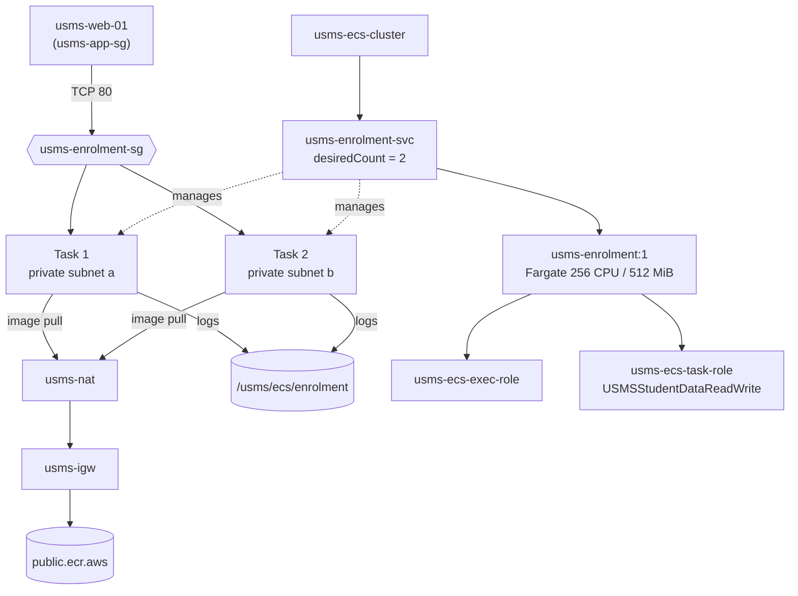

# Lab 04 - Amazon ECS: Deploying the USMS Enrolment Service on Fargate

**Course:** DSO303 | **Environment:** Floci (local AWS emulator) on Docker Compose, AWS CLI v2, macOS

---

## 1. Aim / Objective

To deploy the USMS enrolment service on Amazon ECS using the Fargate launch type, by creating an ECS cluster, a CloudWatch Logs log group, a task execution role, a task role, a security group, and a task definition, and by creating a service that maintains two running tasks across the private subnets established in Lab 02.

## 2. Introduction

Amazon Elastic Container Service (ECS) is a fully managed container orchestration service provided by AWS. It is organised around four principal objects:

- **Cluster:** a logical grouping in which services and tasks are placed.
- **Task definition:** a versioned, immutable blueprint that specifies the container image, CPU and memory allocation, port mappings, IAM roles and logging configuration. A task definition cannot be modified; changes are made by registering a new revision.
- **Task:** a single running instance of a task definition.
- **Service:** a controller that ensures the number of running tasks matches the specified desired count, and replaces any task that stops or fails.

The Fargate launch type removes the need to provision or manage EC2 instances, since AWS supplies and maintains the underlying compute capacity. However, Fargate does not remove the networking layer: each task operating in `awsvpc` mode receives its own elastic network interface, private IP address and security group, and is subject to the route tables of the VPC. ECS is significant in cloud computing because it enables applications to be self-healing, easily updated and scalable without manual server administration.

## 3. Use Case

Amazon ECS is commonly used to run APIs and microservices, such as the USMS enrolment API, where individual components of an application are deployed and managed independently. It is well suited to workloads with pronounced demand peaks, such as university enrolment periods, in which a large volume of requests arrives within a short time. ECS is also used for batch processing and scheduled jobs that do not require permanently running servers, and for controlled application releases, in which a new task definition revision is deployed while the previous revision remains available for rollback.

## 4. System Architecture / Design

The web tier instance from Lab 03 is the only permitted source of traffic to the enrolment tasks, on TCP port 80. The two tasks are placed in separate private subnets in different Availability Zones, so the service remains available if one zone fails. The tasks are not assigned public IP addresses. Container images are pulled through the private route table, NAT gateway and internet gateway created in Lab 02. Container output is sent to the CloudWatch Logs group. The task execution role is used to start each task, and the task role provides the identity under which the application runs.

## 5. Implementation Procedure

**Step 1 – Environment resumption.** Floci was started and the environment files from Labs 01 to 03 were loaded. The eight values required by the lab, including both private subnet IDs and the web tier security group, were printed to confirm that none were empty.

**Step 2 – Verification of previous labs.** The Lab 02 and Lab 03 verification scripts were executed to confirm that the underlying network and compute resources were intact before any new resources were created.

**Step 3 – Floci capability probe.** The level of support for ECS, Application Auto Scaling, CloudWatch and CloudWatch Logs in the Floci build was tested, and the resulting support path was recorded.

**Step 4 – Cluster creation.** The `usms-developer-role` was assumed, and `usms-ecs-cluster` was created with Container Insights enabled. The temporary credentials were then removed to restore the default identity.

**Step 5 – Log group creation.** The log group `/usms/ecs/enrolment` was created and a 7-day retention policy was applied using a separate command.

**Step 6 – Task execution role.** A trust policy permitting `ecs-tasks.amazonaws.com` to assume the role was written, and `usms-ecs-exec-role` was created. A least-privilege customer managed policy, `USMSECSTaskExecution`, was attached, permitting image pulls and log writes restricted to the single log group.

**Step 7 – Task role.** `usms-ecs-task-role` was created using the same trust policy, and the existing `USMSStudentDataReadWrite` policy from Lab 01 was attached without modification.

**Step 8 – Security group.** `usms-enrolment-sg` was created with a single inbound rule permitting TCP port 80 from `usms-app-sg`. A security group reference was used in place of a CIDR range so that the rule remains valid as task IP addresses change.

**Step 9 – Task definition.** A task definition document specifying the Fargate launch type, `awsvpc` network mode, 256 CPU units, 512 MiB of memory, both IAM roles and the `awslogs` configuration was written, checked for unexpanded variables, and registered as `usms-enrolment:1`.

**Step 10 – Service creation.** `usms-enrolment-svc` was created with a desired count of two, distributed across both private subnets, with public IP assignment disabled.

**Step 11 – Service inspection.** The desired, running and pending counts and the service status were read back. The desired count was then changed manually to three and returned to two.

**Step 12 – Recording outputs.** `configs/lab-04.env` was generated by retrieving each value from the API rather than from shell variables, for use in subsequent labs.

**Step 13 – Version control.** The staging area was inspected to confirm that no files from `outputs/` were included, and the lab files were committed.

A verification script, `verify-lab-04.sh`, was also created to check all resources and their configuration. An end-of-course cleanup script, `lab-04-cleanup.sh`, was written and syntax-checked but not executed.

## 6. Results and Evidence

### 6.1 CLI / SDK Output

**Step 1 – Environment loaded**

The identity check confirmed operation against the Floci account (`000000000000`), and all eight required values were populated.

**Step 2 – Previous labs verified**

Both verification scripts were executed before any Lab 04 resource was created, with `FAIL=0` required on each.

**Step 3 – Floci capability probe**

The probe reported the availability of each service, and the corresponding support path was recorded for use in Lab 06.

**Step 4 – Cluster created under the developer role**

The caller identity returned an `assumed-role/usms-developer-role` ARN, confirming that the cluster was created under the least-privileged role. The cluster was reported as ACTIVE with no services or running tasks.

**Step 5 – Log group with retention**

The log group was listed with a retention period of 7 days and no stored data.

**Step 6 – Task execution role**

The role's trust principal was confirmed as `ecs-tasks.amazonaws.com`, and `USMSECSTaskExecution` was listed as an attached policy.

**Step 7 – Task role with reused policy**

`USMSStudentDataReadWrite` was listed as attached to the task role. The retrieved policy document was identical to the one traced from the EC2 instance in Lab 03.

**Step 8 – Enrolment security group**

The security group contained a single inbound rule on port 80, with the web tier security group ID as its source and no CIDR range.

**Step 9 – Task definition registered**

`usms-enrolment:1` was reported as ACTIVE, with `awsvpc` networking, Fargate compatibility, and distinct ARNs for the execution role and the task role.

**Step 10 – Service created**

The service ARN followed the format `service/usms-ecs-cluster/usms-enrolment-svc`, which is required for the scalable target registration in Lab 06.

**Step 11 – Service state and manual scaling**

The service reported a desired count of two, both private subnet IDs, and public IP assignment set to DISABLED. Adjusting the desired count to three and back to two produced corresponding entries in the service events log.

**Step 12 – Environment file**

The validation check confirmed that all values were populated, and the file contained 17 exported variables.

**Step 13 – Commit**

`git check-ignore` identified the rule excluding the assumed-role credentials file, and only the intended lab files were committed.

**Verification script**

`verify-lab-04.sh` evaluates 38 checks covering the environment, dependencies on previous labs, IAM, logging, ECS, networking and repository hygiene.

### 6.2 AWS Management Console Verification

Floci operates as a local emulator and does not provide an AWS Management Console. All resources were therefore verified using the equivalent AWS CLI `describe` operations shown in Section 6.1, which return the same information displayed in the console.

## 7. Analysis and Discussion

The practical produced a complete and correctly configured ECS deployment. The service is placed in the intended private subnets, protected by a security group that accepts traffic only from the web tier, assigned two distinct IAM roles, and configured to send its logs to a dedicated log group with defined retention. The service is not yet reachable from outside the VPC. This is by design, as a load balancer is introduced in Lab 05.

The principal difference between the emulated and real environments concerns container execution. On AWS, the running count would reach two within approximately one minute as Fargate pulled the image and started the tasks. On Floci, the running count may remain at zero, since some builds store the service configuration without launching containers. Because the lab's verification is based on the desired count and static configuration rather than live containers, this behaviour does not prevent completion, but it is recorded as a limitation. Container Insights metrics and task credential delivery are similarly unavailable in the emulator.

Several configuration details in this lab are prone to error:
- CPU and memory values must be supplied as strings rather than numbers.
- The trust principal must be `ecs-tasks.amazonaws.com`, not `ecs.amazonaws.com`.
- The network configuration string must not contain spaces or quoted subnet identifiers.
- The temporary credentials from Step 4 must be unset afterwards, to avoid `ExpiredToken` errors that do not indicate their cause.

Further observations were made during the implementation. Tagging conventions differ between services: ECS uses lower-case `key` and `value`, EC2 and IAM use capitalised keys, and CloudWatch Logs uses a plain map. The NAT gateway created in Lab 02 is the component that allows tasks in private subnets to retrieve container images. In addition, the S3 access policy defined in Lab 01 is now applied to both an EC2 instance and an ECS task without modification, demonstrating that the same permissions can be delivered to different compute types through different mechanisms.

## 8. Reflection

**1. What was learned about this AWS service?**
The practical clarified the distinct roles of the four ECS objects, and in particular that scaling affects only the desired count of a service, never the task definition itself. It also clarified the separation between the task execution role, which is used before the application starts to pull the image and initialise logging, and the task role, which provides the application's runtime permissions.

**2. What challenges were encountered?**
The main conceptual challenge was distinguishing the two IAM roles, since both share an identical trust policy and differ only in purpose. Practical challenges included the precise syntax required for the network configuration and the inconsistent tagging formats across services. A further challenge was distinguishing outcomes observable in the emulator from those that could only be reasoned about.

**3. How would this service be applied in a real-world cloud environment?**
In a production environment, application APIs would be deployed as ECS services on Fargate within private subnets, fronted by a load balancer. Each service would be assigned a dedicated task role following the principle of least privilege, security group rules would reference other security groups rather than IP ranges, log groups would carry appropriate retention periods, and auto scaling would be applied to respond to changes in demand.

**4. What additional concepts or features warrant further exploration?**
Areas for further study include load balancer integration with ECS services, Application Auto Scaling based on utilisation metrics, rolling deployments between task definition revisions, and the use of Fargate Spot to reduce cost.

## 9. Conclusion

This practical deployed the USMS enrolment service on Amazon ECS using the Fargate launch type. A cluster, a log group with a retention policy, separate task execution and task roles, a restrictive security group, a task definition and a service maintaining two tasks across two Availability Zones in private subnets were created and verified. The objectives of the practical were achieved, and the deployment provides the foundation for the load balancer integration in Lab 05.

The key concepts covered were the four ECS objects and their responsibilities, the distinction between the two ECS IAM roles, the use of security group references for dynamic workloads, and the continued dependence of Fargate tasks on the VPC networking layer. Skills were developed in writing task definitions, configuring IAM roles for containers, and verifying configuration through the AWS CLI. Amazon ECS is an important service for building reliable, self-healing applications that can be scaled without manual server management.

## 10. Appendix

- `policies/trust-ecs-tasks.json` – trust policy for both ECS roles
- `policies/usms-ecs-task-execution-policy.json` – task execution role permissions
- `policies/usms-enrolment-sg-ingress.json` – security group ingress rule
- `templates/lab-04-taskdef.json` – task definition document
- `configs/lab-04.env` – recorded resource names and ARNs
- `scripts/utilities/verify-lab-04.sh` – verification script
- `scripts/cleanup/lab-04-cleanup.sh` – cleanup script (not executed)